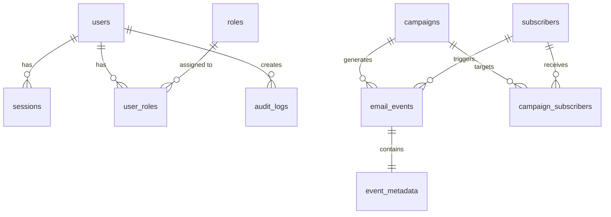

# Database Schema Design

Design comprehensive database schema for feature: **$ARGUMENTS**

## Context Validation

### Previous Phases Check

- Use cases: @.kiro/specs/$ARGUMENTS/usecase.md
- Sequence diagrams: @.kiro/specs/$ARGUMENTS/sequence.md
- Spec metadata: @.kiro/specs/$ARGUMENTS/spec.json

**CRITICAL**: Schema design requires approved use cases and sequence diagrams.

## Interactive Approval

Before generating schema, ask the user:
```
Ready to generate database schema for $ARGUMENTS?
Sequence diagrams should be reviewed first.
Have you reviewed sequence.md? [y/N]: 
```

If 'N': Stop and request review of sequence diagrams first.
If 'y': Update spec.json to mark sequence as approved and proceed:
```json
{
  "approvals": {
    "sequence": {
      "generated": true,
      "approved": true
    }
  }
}
```

## Task: Generate Database Schema

Generate schema.md with complete database design:

### 1. Schema Document Structure

```markdown
# Database Schema: [Feature Name]

## Overview
Database design based on data elements identified in use cases and sequence diagrams.

## Design Principles
- Normalization: 3NF minimum
- Performance: Optimized for read-heavy operations
- Scalability: Partition-ready design
- Integrity: Foreign key constraints
- Audit: Change tracking included

## Entity Relationship Diagram



## Core Tables

### Table: users
Primary entity for system users.

```sql
CREATE TABLE users (
    -- Primary Key
    id UUID PRIMARY KEY DEFAULT gen_random_uuid(),
    
    -- Core Fields
    email VARCHAR(255) NOT NULL UNIQUE,
    username VARCHAR(100) UNIQUE,
    password_hash VARCHAR(255) NOT NULL,
    
    -- Profile Fields
    first_name VARCHAR(100),
    last_name VARCHAR(100),
    phone VARCHAR(20),
    
    -- Status Fields
    status VARCHAR(20) NOT NULL DEFAULT 'active' 
        CHECK (status IN ('active', 'inactive', 'suspended', 'deleted')),
    email_verified BOOLEAN DEFAULT FALSE,
    
    -- Timestamps
    created_at TIMESTAMPTZ NOT NULL DEFAULT NOW(),
    updated_at TIMESTAMPTZ NOT NULL DEFAULT NOW(),
    deleted_at TIMESTAMPTZ,
    
    -- Metadata
    metadata JSONB DEFAULT '{}'::jsonb
);

-- Indexes
CREATE INDEX idx_users_email ON users(email) WHERE deleted_at IS NULL;
CREATE INDEX idx_users_status ON users(status);
CREATE INDEX idx_users_created_at ON users(created_at DESC);
CREATE INDEX idx_users_metadata ON users USING GIN(metadata);
```

### Table: campaigns
Campaign management table.

```sql
CREATE TABLE campaigns (
    id UUID PRIMARY KEY DEFAULT gen_random_uuid(),
    
    -- Relationships
    user_id UUID NOT NULL REFERENCES users(id) ON DELETE CASCADE,
    template_id UUID REFERENCES templates(id) ON DELETE SET NULL,
    
    -- Core Fields
    name VARCHAR(255) NOT NULL,
    subject VARCHAR(500) NOT NULL,
    from_email VARCHAR(255) NOT NULL,
    from_name VARCHAR(255),
    
    -- Content
    html_content TEXT,
    text_content TEXT,
    
    -- Scheduling
    scheduled_at TIMESTAMPTZ,
    sent_at TIMESTAMPTZ,
    
    -- Status
    status VARCHAR(20) NOT NULL DEFAULT 'draft'
        CHECK (status IN ('draft', 'scheduled', 'sending', 'sent', 'failed', 'cancelled')),
    
    -- Metrics (denormalized for performance)
    total_recipients INTEGER DEFAULT 0,
    sent_count INTEGER DEFAULT 0,
    delivered_count INTEGER DEFAULT 0,
    opened_count INTEGER DEFAULT 0,
    clicked_count INTEGER DEFAULT 0,
    bounced_count INTEGER DEFAULT 0,
    
    -- Timestamps
    created_at TIMESTAMPTZ NOT NULL DEFAULT NOW(),
    updated_at TIMESTAMPTZ NOT NULL DEFAULT NOW()
);

-- Indexes
CREATE INDEX idx_campaigns_user_id ON campaigns(user_id);
CREATE INDEX idx_campaigns_status ON campaigns(status);
CREATE INDEX idx_campaigns_scheduled_at ON campaigns(scheduled_at) 
    WHERE scheduled_at IS NOT NULL;
```

### Table: email_events
Event tracking for email interactions.

```sql
CREATE TABLE email_events (
    id UUID PRIMARY KEY DEFAULT gen_random_uuid(),
    
    -- Relationships
    campaign_id UUID NOT NULL REFERENCES campaigns(id) ON DELETE CASCADE,
    subscriber_id UUID NOT NULL REFERENCES subscribers(id) ON DELETE CASCADE,
    
    -- Event Details
    event_type VARCHAR(20) NOT NULL 
        CHECK (event_type IN ('sent', 'delivered', 'opened', 'clicked', 'bounced', 'unsubscribed', 'complained')),
    
    -- Additional Data
    ip_address INET,
    user_agent TEXT,
    link_url TEXT, -- For click events
    bounce_reason TEXT, -- For bounce events
    
    -- Timestamp
    created_at TIMESTAMPTZ NOT NULL DEFAULT NOW()
);

-- Indexes for analytics queries
CREATE INDEX idx_email_events_campaign_id ON email_events(campaign_id);
CREATE INDEX idx_email_events_subscriber_id ON email_events(subscriber_id);
CREATE INDEX idx_email_events_type ON email_events(event_type);
CREATE INDEX idx_email_events_created_at ON email_events(created_at DESC);
CREATE INDEX idx_email_events_campaign_type_created 
    ON email_events(campaign_id, event_type, created_at DESC);

-- Partitioning for scalability (monthly partitions)
-- CREATE TABLE email_events_2025_01 PARTITION OF email_events
--     FOR VALUES FROM ('2025-01-01') TO ('2025-02-01');
```

## Materialized Views

### View: campaign_metrics
Pre-aggregated metrics for performance.

```sql
CREATE MATERIALIZED VIEW campaign_metrics AS
SELECT 
    c.id as campaign_id,
    c.name as campaign_name,
    c.created_at as campaign_created_at,
    COUNT(DISTINCT CASE WHEN e.event_type = 'sent' THEN e.subscriber_id END) as unique_sent,
    COUNT(DISTINCT CASE WHEN e.event_type = 'delivered' THEN e.subscriber_id END) as unique_delivered,
    COUNT(DISTINCT CASE WHEN e.event_type = 'opened' THEN e.subscriber_id END) as unique_opened,
    COUNT(DISTINCT CASE WHEN e.event_type = 'clicked' THEN e.subscriber_id END) as unique_clicked,
    
    -- Rates
    CASE 
        WHEN COUNT(DISTINCT CASE WHEN e.event_type = 'sent' THEN e.subscriber_id END) > 0
        THEN CAST(COUNT(DISTINCT CASE WHEN e.event_type = 'opened' THEN e.subscriber_id END) AS DECIMAL) / 
             COUNT(DISTINCT CASE WHEN e.event_type = 'sent' THEN e.subscriber_id END) * 100
        ELSE 0
    END as open_rate,
    
    MAX(e.created_at) as last_activity_at
FROM campaigns c
LEFT JOIN email_events e ON c.id = e.campaign_id
GROUP BY c.id, c.name, c.created_at;

-- Refresh strategy
CREATE INDEX idx_campaign_metrics_campaign_id ON campaign_metrics(campaign_id);
-- REFRESH MATERIALIZED VIEW CONCURRENTLY campaign_metrics;
```

## Constraints and Validations

### Business Rules Enforcement
```sql
-- Ensure email uniqueness per campaign
ALTER TABLE campaign_subscribers 
    ADD CONSTRAINT unique_campaign_subscriber 
    UNIQUE(campaign_id, subscriber_id);

-- Prevent duplicate events
ALTER TABLE email_events
    ADD CONSTRAINT unique_event_per_type
    UNIQUE(campaign_id, subscriber_id, event_type, created_at);

-- Check valid email format
ALTER TABLE users
    ADD CONSTRAINT check_email_format
    CHECK (email ~* '^[A-Za-z0-9._%+-]+@[A-Za-z0-9.-]+\.[A-Za-z]{2,}$');
```

## Indexes Strategy

### Query Patterns and Indexes
```sql
-- Pattern: Find user by email (login)
-- Index: idx_users_email (already created)

-- Pattern: Get campaigns by status and date
CREATE INDEX idx_campaigns_status_created 
    ON campaigns(status, created_at DESC);

-- Pattern: Analytics aggregation by date range
CREATE INDEX idx_email_events_date_range
    ON email_events(created_at, campaign_id, event_type);

-- Pattern: Find subscriber engagement
CREATE INDEX idx_subscriber_engagement
    ON email_events(subscriber_id, event_type, created_at DESC);
```

## Migration Scripts

### Initial Migration
```sql
-- Migration: 001_create_initial_schema.sql
BEGIN;

-- Create tables in dependency order
CREATE TABLE users (...);
CREATE TABLE roles (...);
CREATE TABLE user_roles (...);
CREATE TABLE subscribers (...);
CREATE TABLE campaigns (...);
CREATE TABLE campaign_subscribers (...);
CREATE TABLE email_events (...);

-- Create indexes
CREATE INDEX ...;

-- Create materialized views
CREATE MATERIALIZED VIEW ...;

COMMIT;
```

### Rollback Script
```sql
-- Rollback: 001_create_initial_schema_rollback.sql
BEGIN;

DROP MATERIALIZED VIEW IF EXISTS campaign_metrics CASCADE;
DROP TABLE IF EXISTS email_events CASCADE;
DROP TABLE IF EXISTS campaign_subscribers CASCADE;
DROP TABLE IF EXISTS campaigns CASCADE;
DROP TABLE IF EXISTS subscribers CASCADE;
DROP TABLE IF EXISTS user_roles CASCADE;
DROP TABLE IF EXISTS roles CASCADE;
DROP TABLE IF EXISTS users CASCADE;

COMMIT;
```

## Performance Considerations

### Partitioning Strategy
- email_events: Monthly partitions for time-series data
- audit_logs: Yearly partitions for compliance

### Archival Strategy
- Move events older than 1 year to archive tables
- Compress archived data

### Cache Strategy
- Campaign metrics: 5-minute cache
- User sessions: 30-minute cache
- Static lookups: 1-hour cache
```

### 2. Schema Validation

Ensure schema includes:
- **Primary keys**: UUID for distributed systems
- **Foreign keys**: Referential integrity
- **Indexes**: For all query patterns
- **Constraints**: Business rule enforcement
- **Audit fields**: created_at, updated_at, deleted_at
- **Soft deletion**: Support for data recovery

### 3. Performance Optimization

Design for:
- **Read optimization**: Appropriate indexes
- **Write optimization**: Minimal indexes on high-write tables
- **Aggregation**: Materialized views for analytics
- **Partitioning**: For large time-series data
- **Sharding ready**: UUID keys enable sharding

### 4. Update Metadata

Update spec.json:
```json
{
  "phase": "schema-defined",
  "tables_count": [number],
  "indexes_count": [number],
  "approvals": {
    "usecase": {
      "generated": true,
      "approved": true
    },
    "sequence": {
      "generated": true,
      "approved": true
    },
    "schema": {
      "generated": true,
      "approved": false
    }
  },
  "updated_at": "current_timestamp"
}
```

## Instructions

1. **Analyze data elements** from use cases
2. **Normalize to 3NF** - Eliminate redundancy
3. **Add relationship tables** - Many-to-many joins
4. **Define primary keys** - Use UUIDs
5. **Add foreign keys** - Maintain integrity
6. **Create indexes** - Based on query patterns
7. **Add constraints** - Business rules
8. **Include audit fields** - Tracking changes
9. **Design for scale** - Partitioning strategy
10. **Write migrations** - Up and down scripts

Generate a robust schema that **prevents the database redesign problem** by thoroughly analyzing all data needs upfront.

## Output

Write `.kiro/specs/$ARGUMENTS/schema.md` with complete database design.