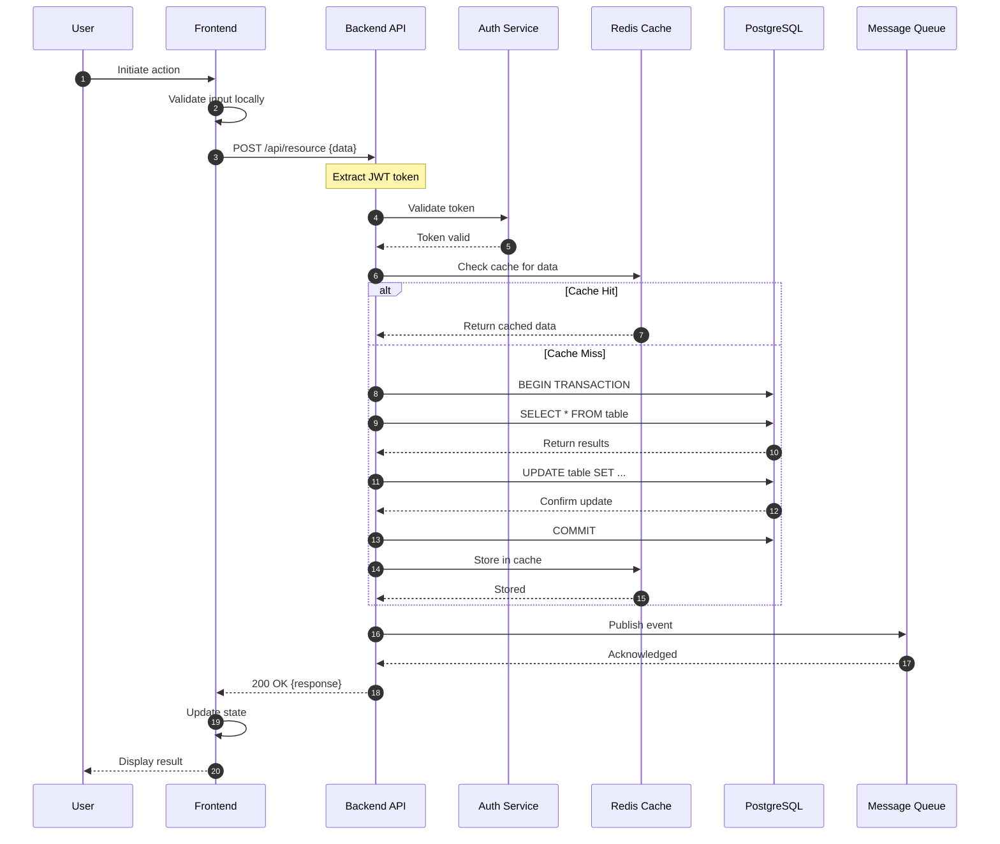
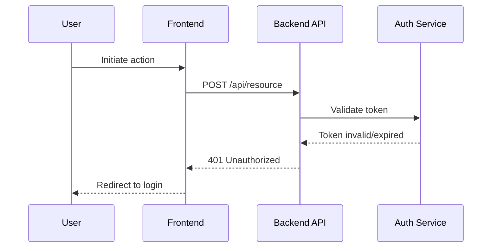
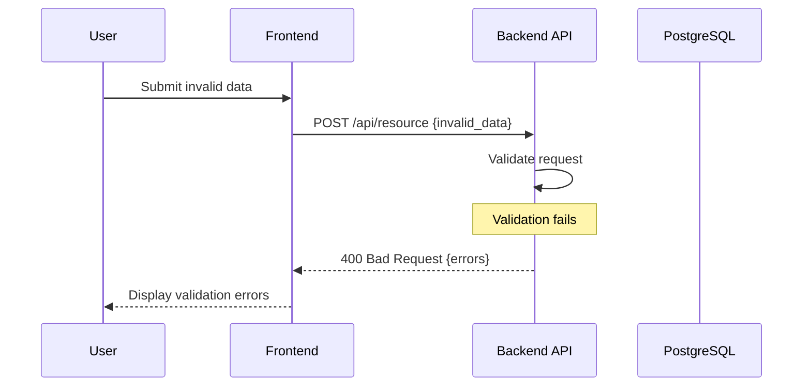
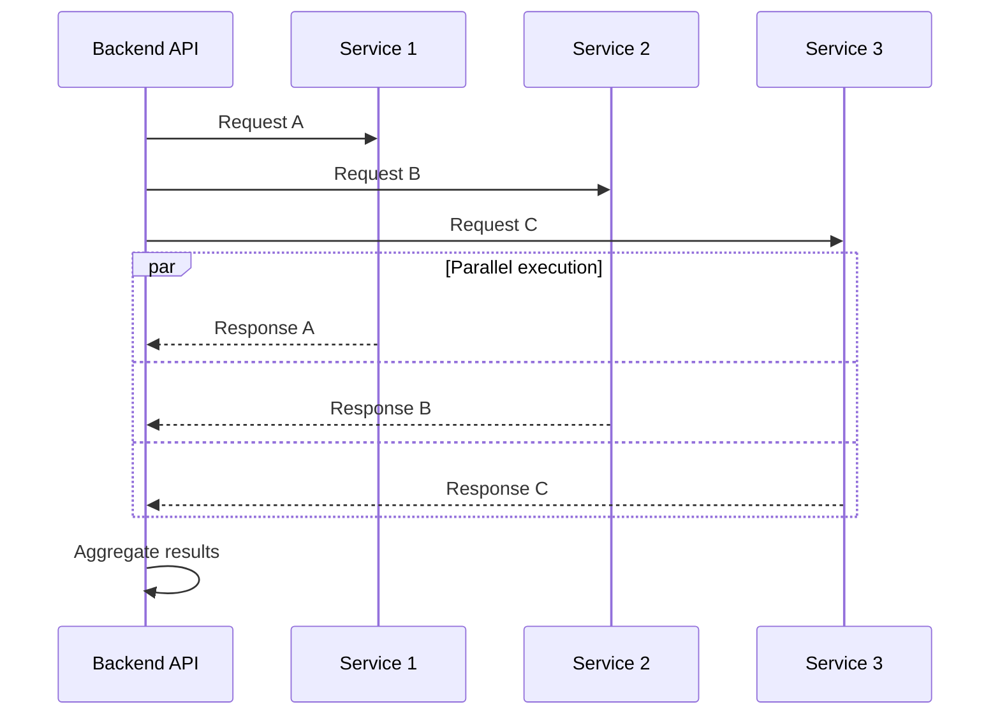
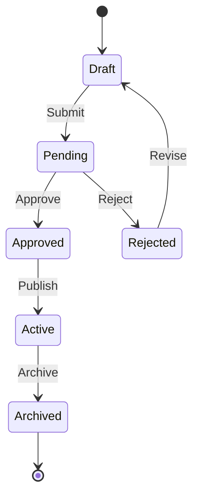

# Sequence Diagram Generation

Create comprehensive sequence diagrams for feature: **$ARGUMENTS**

## Language Setting
**IMPORTANT**: Generate all content in English, not Japanese.

## Context Validation

### Previous Phase Check

- Use cases: @.kiro/specs/$ARGUMENTS/usecase.md
- Spec metadata: @.kiro/specs/$ARGUMENTS/spec.json

**CRITICAL**: Sequence diagrams can only be created after use cases are defined and approved.

### Interactive Approval

Before generating sequence diagrams, ask the user:
```
Ready to generate sequence diagrams for $ARGUMENTS?
Use cases should be reviewed first.
Have you reviewed usecase.md? [y/N]: 
```

If 'N': Stop and request review of use cases first.
If 'y': Update spec.json to mark use cases as approved and proceed:
```json
{
  "approvals": {
    "usecase": {
      "generated": true,
      "approved": true
    }
  }
}
```

## Task: Generate Sequence Diagrams

Generate sequence.md with detailed interaction flows:

### 1. Sequence Diagram Document Structure

```markdown
# Sequence Diagrams: [Feature Name]

## Overview
Detailed interaction flows for all use cases defined in usecase.md

## Diagram Legend
- Solid arrow (->): Synchronous call
- Dashed arrow (-->): Asynchronous response
- Note: Internal processing
- Alt/Else: Conditional flow
- Loop: Repeated operations
- Par: Parallel processing

## Primary Sequences

### Sequence 1: [UC-1 Primary Use Case]

#### Success Flow


#### Error Flow - Authentication Failure


#### Error Flow - Validation Failure


### Sequence 2: [UC-2 Secondary Use Case]
[Additional sequence diagrams for other use cases]

## Data Flow Details

### Request/Response Payloads

#### Request to /api/resource
```json
{
  "field1": "value",
  "field2": 123,
  "nested": {
    "field3": "value"
  }
}
```

#### Success Response
```json
{
  "id": "uuid",
  "status": "success",
  "data": {
    "field1": "value",
    "calculated_field": 456
  }
}
```

#### Error Response
```json
{
  "error": {
    "code": "VALIDATION_ERROR",
    "message": "Invalid input",
    "details": [
      {
        "field": "field1",
        "message": "Required field missing"
      }
    ]
  }
}
```

## Timing Constraints

### Performance Requirements
- API response time: < 200ms (p95)
- Database query: < 50ms
- Cache lookup: < 5ms
- Total end-to-end: < 500ms

### Timeout Settings
- Frontend API call timeout: 30s
- Backend database timeout: 10s
- Cache timeout: 1s

## Concurrency Handling

### Parallel Processing


## State Transitions

### Entity State Machine


## Integration Points

### External Services
- Authentication: OAuth2/JWT
- Payment: Stripe API
- Email: SendGrid/SES
- Storage: S3/CloudStorage

### Message Queue Events
- Event: resource.created
- Event: resource.updated
- Event: resource.deleted
```

### 2. Critical Path Identification

Identify and document:
- **Synchronous operations**: Must complete before response
- **Asynchronous operations**: Can happen in background
- **Cacheable operations**: Can be served from cache
- **Transactional boundaries**: What must be atomic

### 3. Error Scenario Coverage

For each sequence, document:
- Authentication failures
- Authorization failures
- Validation errors
- Database errors
- Network timeouts
- Service unavailable
- Rate limiting

### 4. Data Validation Points

Mark where validation occurs:
- Frontend validation
- API input validation
- Business rule validation
- Database constraints

### 5. Update Metadata

Update spec.json:
```json
{
  "phase": "sequence-defined",
  "sequences_count": [number],
  "error_flows_defined": true,
  "approvals": {
    "usecase": {
      "generated": true,
      "approved": true
    },
    "sequence": {
      "generated": true,
      "approved": false
    }
  },
  "updated_at": "current_timestamp"
}
```

## Instructions

1. **Read use cases thoroughly** - Understand all flows
2. **Map actors to components** - User → UI → API → DB
3. **Detail happy path first** - Complete success scenario
4. **Add error scenarios** - All failure modes
5. **Include timing info** - Timeouts and performance
6. **Show data payloads** - Request/response examples
7. **Mark transaction boundaries** - What's atomic
8. **Identify parallel operations** - What can run concurrently
9. **Document state transitions** - How entities change
10. **Update tracking metadata** - Record completion

Generate comprehensive sequence diagrams that show **exactly how the system will work** including all error cases and edge conditions.

## Output

Write `.kiro/specs/$ARGUMENTS/sequence.md` with complete interaction flows in English.