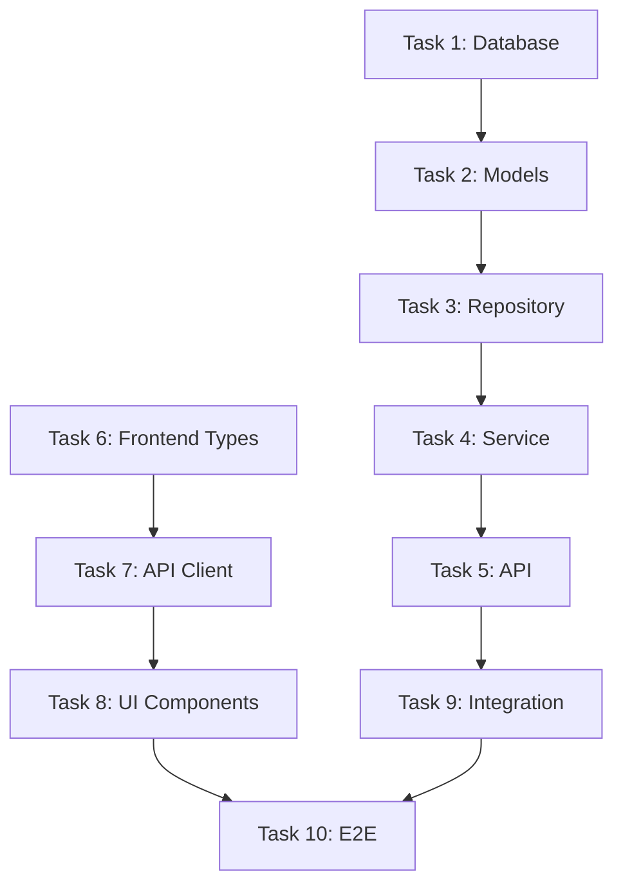

# Implementation Tasks with Specification References

Generate detailed implementation tasks for feature: **$ARGUMENTS**

## Context Validation

### All Specifications Must Be Available

- Use cases: @.kiro/specs/$ARGUMENTS/usecase.md
- Sequence diagrams: @.kiro/specs/$ARGUMENTS/sequence.md
- Database schema: @.kiro/specs/$ARGUMENTS/schema.md
- API specification: @.kiro/specs/$ARGUMENTS/api.md
- Interface definitions: @.kiro/specs/$ARGUMENTS/interfaces.md
- Test specifications: @.kiro/specs/$ARGUMENTS/tests-red.md
- Spec metadata: @.kiro/specs/$ARGUMENTS/spec.json

**CRITICAL**: Every task MUST reference specific sections from the specifications.
**NO AI SELF-JUDGMENT**: Tasks must follow specifications exactly, not interpret or assume.

## Interactive Approval

Before generating tasks, ask the user:
```
Ready to generate implementation tasks for $ARGUMENTS?
All specifications and test cases should be reviewed first.
Have you reviewed all specifications including tests-red.md? [y/N]: 
```

If 'N': Stop and request review of specifications first.
If 'y': Update spec.json to mark tests as approved and proceed:
```json
{
  "approvals": {
    "tests": {
      "generated": true,
      "approved": true
    }
  }
}
```

## Task: Generate Implementation Tasks

Generate tasks.md with explicit specification references:

### 1. Task Document Structure

```markdown
# Implementation Tasks: [Feature Name]

## Overview
Each task includes mandatory references to specifications.
NO implementation decisions without specification backing.

## Task List with Specification References

### Task 1: Create Database Schema
**Specification References:**
- Schema definition: `schema.md#core-tables`
- Migration scripts: `schema.md#migration-scripts`
- Indexes: `schema.md#indexes-strategy`
- Constraints: `schema.md#constraints-and-validations`

**Implementation Steps:**
1. Create migration file following `schema.md#initial-migration`
2. Add tables in exact order from `schema.md#core-tables`
3. Add indexes from `schema.md#indexes-strategy`
4. Add constraints from `schema.md#constraints-and-validations`

**Validation:**
- Test case: `tests-red.md#database-integration-tests`
- Expected state: Tables created, constraints active

---

### Task 2: Implement Data Models
**Specification References:**
- Type definitions: `interfaces.md#backend-types`
- Validation rules: `interfaces.md#validation-rules`
- Serialization: `interfaces.md#serialization-contracts`
- Database mapping: `schema.md#table-[name]`

**Implementation Steps:**
1. Create model classes from `interfaces.md#backend-types`
2. Add validation from `interfaces.md#field-validations`
3. Map to database using `schema.md#table-definitions`
4. Add serialization from `interfaces.md#serialization-contracts`

**Validation:**
- Test case: `tests-red.md#unit-tests-backend`
- Expected state: Models instantiate, validate, serialize

---

### Task 3: Implement Repository Layer
**Specification References:**
- Database queries: `sequence.md#database-operations`
- Transaction boundaries: `sequence.md#transaction-handling`
- Error handling: `api.md#error-codes`
- Pagination: `api.md#pagination-structure`

**Implementation Steps:**
1. Create repository interface from `sequence.md#data-access-patterns`
2. Implement CRUD operations per `schema.md#query-patterns`
3. Add transaction handling from `sequence.md#transaction-boundaries`
4. Implement pagination from `api.md#pagination`

**Validation:**
- Test case: `tests-red.md#database-integration-tests`
- Expected state: All CRUD operations functional

---

### Task 4: Implement Service Layer
**Specification References:**
- Business logic: `usecase.md#business-rules`
- Calculations: `usecase.md#calculated-fields`
- Validation: `usecase.md#validation-rules`
- Error scenarios: `sequence.md#error-flows`

**Implementation Steps:**
1. Create service class structure from `usecase.md#use-cases`
2. Implement business rules from `usecase.md#business-rules`
3. Add calculations from `usecase.md#calculated-fields`
4. Handle errors per `sequence.md#error-scenarios`

**Validation:**
- Test case: `tests-red.md#unit-tests-backend-service`
- Expected state: Business logic executes correctly

---

### Task 5: Implement API Endpoints
**Specification References:**
- Endpoint definitions: `api.md#api-endpoints`
- Request/Response: `api.md#component-schemas`
- Authentication: `api.md#authentication`
- Error responses: `api.md#error-response-pattern`

**Implementation Steps:**
1. Create routes from `api.md#endpoint-[name]`
2. Parse requests per `api.md#request-schemas`
3. Format responses per `api.md#response-schemas`
4. Add auth middleware from `api.md#security-schemes`

**Validation:**
- Test case: `tests-red.md#api-integration-tests`
- Expected state: All endpoints return correct status codes

---

### Task 6: Implement Frontend Types
**Specification References:**
- Type definitions: `interfaces.md#frontend-types`
- API contracts: `interfaces.md#request-response-interfaces`
- State types: `interfaces.md#state-management-types`
- Validation: `interfaces.md#frontend-validation`

**Implementation Steps:**
1. Create type definitions from `interfaces.md#typescript-definitions`
2. Add request types from `interfaces.md#request-interfaces`
3. Add response types from `interfaces.md#response-interfaces`
4. Create state types from `interfaces.md#state-types`

**Validation:**
- Test case: `tests-red.md#frontend-unit-tests`
- Expected state: Types compile without errors

---

### Task 7: Implement API Client
**Specification References:**
- API endpoints: `api.md#api-endpoints`
- Request format: `api.md#request-examples`
- Response handling: `api.md#response-examples`
- Error handling: `api.md#error-codes`

**Implementation Steps:**
1. Create API client from `api.md#base-configuration`
2. Add methods for each endpoint in `api.md#endpoints`
3. Handle responses per `api.md#response-patterns`
4. Handle errors per `api.md#error-response-pattern`

**Validation:**
- Test case: `tests-red.md#frontend-service-tests`
- Expected state: API calls succeed with mocked backend

---

### Task 8: Implement UI Components
**Specification References:**
- User interactions: `usecase.md#basic-flow`
- Data display: `sequence.md#ui-updates`
- Error display: `sequence.md#error-flows`
- State management: `sequence.md#state-transitions`

**Implementation Steps:**
1. Create components for each screen in `usecase.md#ui-screens`
2. Handle interactions from `sequence.md#user-actions`
3. Display data per `usecase.md#data-display-requirements`
4. Show errors from `sequence.md#error-display`

**Validation:**
- Test case: `tests-red.md#component-tests`
- Expected state: Components render and handle events

---

### Task 9: Implement Integration Points
**Specification References:**
- External services: `sequence.md#external-services`
- Message queues: `sequence.md#message-queue-events`
- Cache operations: `sequence.md#cache-operations`
- Background jobs: `sequence.md#async-operations`

**Implementation Steps:**
1. Connect external services from `sequence.md#integration-points`
2. Implement queue handlers from `sequence.md#message-patterns`
3. Add caching per `sequence.md#cache-strategy`
4. Create background jobs from `sequence.md#async-processing`

**Validation:**
- Test case: `tests-red.md#integration-tests`
- Expected state: All integrations functional

---

### Task 10: Complete E2E Implementation
**Specification References:**
- User journeys: `usecase.md#use-cases`
- Complete flows: `sequence.md#success-flows`
- Error recovery: `sequence.md#error-recovery`
- Performance targets: `api.md#performance-requirements`

**Implementation Steps:**
1. Wire together all components per `sequence.md#complete-flow`
2. Implement full user journey from `usecase.md#basic-flow`
3. Add error recovery from `sequence.md#error-recovery`
4. Optimize for performance per `api.md#timing-constraints`

**Validation:**
- Test case: `tests-red.md#e2e-tests`
- Expected state: Complete user journey works
```

### 2. Task Template

Every task MUST include:
```markdown
### Task [Number]: [Clear Task Name]
**Specification References:**
- [Aspect 1]: `[spec-file].md#[section]`
- [Aspect 2]: `[spec-file].md#[section]`
- [Aspect 3]: `[spec-file].md#[section]`

**Implementation Steps:**
1. [Step with reference to spec]
2. [Step with reference to spec]
3. [Step with reference to spec]

**Validation:**
- Test case: `tests-red.md#[test-section]`
- Expected state: [What should work after this task]
```

### 3. Specification Reference Rules

#### MANDATORY References
Every task must reference:
1. **What to build**: Link to specification section
2. **How to build**: Link to design decisions
3. **Validation criteria**: Link to test cases
4. **Error handling**: Link to error scenarios

#### FORBIDDEN Actions
Tasks must NOT:
- Make design decisions not in specs
- Add features not in requirements
- Change interfaces from specifications
- Interpret vague requirements (ask for clarification)
- Assume implementation details

### 4. Cross-Reference Matrix

Create a matrix showing task-to-specification mapping:

```markdown
## Specification Coverage Matrix

| Task | Usecase | Sequence | Schema | API | Interfaces | Tests |
|------|---------|----------|--------|-----|------------|-------|
| Task 1 | - | - | ✓ | - | - | ✓ |
| Task 2 | ✓ | - | ✓ | - | ✓ | ✓ |
| Task 3 | - | ✓ | ✓ | ✓ | - | ✓ |
| Task 4 | ✓ | ✓ | - | - | ✓ | ✓ |
| Task 5 | - | ✓ | - | ✓ | ✓ | ✓ |
| Task 6 | - | - | - | - | ✓ | ✓ |
| Task 7 | - | ✓ | - | ✓ | ✓ | ✓ |
| Task 8 | ✓ | ✓ | - | - | ✓ | ✓ |
| Task 9 | - | ✓ | - | - | - | ✓ |
| Task 10 | ✓ | ✓ | - | - | - | ✓ |
```

### 5. Dependency Graph

Show task dependencies:

```markdown
## Task Dependencies


```

### 6. Update Metadata

Update spec.json:
```json
{
  "phase": "tasks-generated",
  "tasks_count": [number],
  "specification_references": {
    "total_references": [count],
    "specs_covered": ["usecase", "sequence", "schema", "api", "interfaces", "tests"]
  },
  "approvals": {
    "tasks": {
      "generated": true,
      "approved": false
    }
  },
  "updated_at": "current_timestamp"
}
```

## Instructions

1. **Review ALL specifications** - Read every spec document
2. **Extract implementation requirements** - What needs to be built
3. **Create tasks with references** - Every task links to specs
4. **NO assumptions** - If not in specs, don't add it
5. **Order by dependencies** - Database → Backend → Frontend → Integration
6. **Include validation** - Link to test cases
7. **Map error handling** - Reference error specifications
8. **Create coverage matrix** - Ensure all specs are covered
9. **Document dependencies** - Show task relationships
10. **Update metadata** - Record task generation

Generate tasks that **eliminate AI self-judgment** by explicitly referencing specifications for every decision.

## Output

Write `.kiro/specs/$ARGUMENTS/tasks.md` with complete implementation tasks including mandatory specification references.