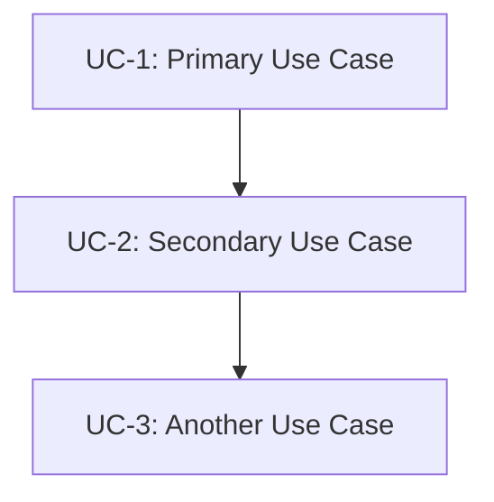
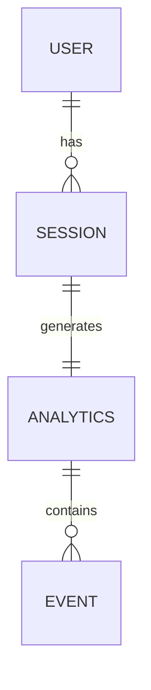

# Use Case Definition

Define comprehensive use cases for feature: **$ARGUMENTS**

## Context Validation

### Steering Context

- Product context: @.kiro/steering/product.md
- Architecture overview: @.kiro/steering/structure.md
- Technical constraints: @.kiro/steering/tech.md

### Existing Spec Context

- Current spec directory: !`ls -la .kiro/specs/$ARGUMENTS/ 2>/dev/null || echo "New feature"`
- Spec metadata: @.kiro/specs/$ARGUMENTS/spec.json

## Approval Process

### Interactive Approval
Before generating use cases, ask the user:
```
Ready to generate use cases for $ARGUMENTS?
Requirements should be reviewed first.
Have you reviewed requirements.md? [y/N]: 
```

If 'N': Stop and request review of requirements first.
If 'y': Update spec.json to mark requirements as approved and proceed:
```json
{
  "approvals": {
    "requirements": {
      "generated": true,
      "approved": true
    }
  }
}
```

## Task: Generate Use Case Document

Generate usecase.md following this structure:

### 1. Use Case Document Structure

```markdown
# Use Case Document: [Feature Name]

## Overview
[Brief description of the feature and its business value]

## Primary Actors
- [Actor 1]: [Role description]
- [Actor 2]: [Role description]

## Use Cases

### UC-1: [Primary Use Case Name]

#### Actors
- Primary: [Actor name]
- Secondary: [Supporting actors if any]

#### Preconditions
- [Condition 1]
- [Condition 2]

#### Basic Flow (Happy Path)
1. [Actor] initiates [action]
2. System validates [condition]
3. System performs [operation]
4. System returns [result]
5. [Actor] receives [feedback]

#### Alternative Flows
##### AF-1.1: [Alternative scenario]
- At step 2, if [condition]
- Then [alternative action]

#### Exception Flows
##### EF-1.1: [Error scenario]
- At any step, if [error condition]
- System displays [error message]
- System logs [error details]

#### Postconditions
- Success: [State after successful completion]
- Failure: [State after failure]

#### Data Elements Required
- Input Data:
  - [field_name]: [type] - [description]
  - [field_name]: [type] - [description]
- Output Data:
  - [field_name]: [type] - [description]
  - [field_name]: [type] - [description]
- Stored Data:
  - [field_name]: [type] - [description]

#### Business Rules
- BR-1: [Business rule description]
- BR-2: [Business rule description]

#### Non-Functional Requirements
- Performance: [e.g., Response within 2 seconds]
- Security: [e.g., Authentication required]
- Scalability: [e.g., Support 1000 concurrent users]

### UC-2: [Secondary Use Case Name]
[Repeat structure for additional use cases]

## Data Element Summary

### Core Entities Identified
Based on all use cases, the following data entities are required:

1. **[Entity Name]**
   - Purpose: [Why this entity is needed]
   - Key Attributes:
     - [attribute]: [type] - [constraint]
     - [attribute]: [type] - [constraint]
   - Relationships:
     - [Relationship to other entities]

2. **[Entity Name]**
   [Continue for all entities]

### Calculated Fields
- [field_name] = [calculation formula]
- [field_name] = [calculation formula]

## Use Case Dependencies


## Acceptance Criteria Summary
[List key acceptance criteria that will be detailed in requirements phase]
```

### 2. Data Element Extraction

Analyze use cases to identify:
- **Input data**: What users provide
- **Output data**: What system returns
- **Stored data**: What needs persistence
- **Calculated data**: Derived values
- **Transient data**: Temporary processing data

### 3. Use Case Validation

Ensure each use case includes:
- Clear actor identification
- Measurable preconditions
- Step-by-step flows
- All data elements needed
- Business rules
- Non-functional requirements

### 4. Create Data Model Preview

Generate initial data model based on identified elements:

```markdown
## Initial Data Model

### Entity Relationship Preview


### Key Entities
- User-related data
- Business domain objects
- System metadata
- Audit/tracking data
```

### 5. Update Metadata

Update spec.json with:
```json
{
  "phase": "usecase-defined",
  "data_elements_identified": true,
  "use_cases_count": [number],
  "approvals": {
    "usecase": {
      "generated": true,
      "approved": false
    }
  },
  "updated_at": "current_timestamp"
}
```

## Instructions

1. **Analyze feature request** - Understand the business need
2. **Identify all actors** - Users, systems, external services
3. **Define primary use case** - Main success scenario
4. **Add alternative flows** - Edge cases and variations
5. **Extract data elements** - Every piece of data mentioned
6. **Identify relationships** - How data connects
7. **Add business rules** - Constraints and validations
8. **Include NFRs** - Performance, security, scalability
9. **Create data model preview** - Initial entity relationships
10. **Update tracking metadata** - Record completion

Generate a comprehensive use case document that serves as the foundation for database schema and API design. Focus on **data discovery** - every field that will be needed should be identified here.

## Output

Write `.kiro/specs/$ARGUMENTS/usecase.md` with complete use case analysis and data element identification in English.