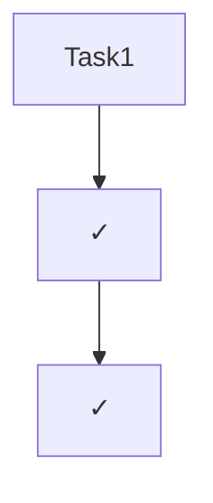

# Specification Validation

Validate specification completeness and task coverage for feature: **$ARGUMENTS**

## Language Setting
**IMPORTANT**: Generate all reports in English, not Japanese.

## Context Validation

### Required Documents Check

- Requirements: @.kiro/specs/$ARGUMENTS/requirements.md
- Use cases: @.kiro/specs/$ARGUMENTS/usecase.md
- Sequence diagrams: @.kiro/specs/$ARGUMENTS/sequence.md
- Database schema: @.kiro/specs/$ARGUMENTS/schema.md
- API specification: @.kiro/specs/$ARGUMENTS/api.md
- Interface definitions: @.kiro/specs/$ARGUMENTS/interfaces.md
- Test specifications: @.kiro/specs/$ARGUMENTS/tests-red.md
- Design document: @.kiro/specs/$ARGUMENTS/design.md
- Implementation tasks: @.kiro/specs/$ARGUMENTS/tasks.md
- Spec metadata: @.kiro/specs/$ARGUMENTS/spec.json

## Task: Validate Specification Coverage

Generate validation-report.md with comprehensive analysis:

### 1. Document Existence Check

```markdown
# Specification Validation Report: [Feature Name]

## Document Status

| Document | Exists | Generated | Approved | Language |
|----------|--------|-----------|----------|----------|
| requirements.md | ✓/✗ | ✓/✗ | ✓/✗ | EN/JP |
| usecase.md | ✓/✗ | ✓/✗ | ✓/✗ | EN/JP |
| sequence.md | ✓/✗ | ✓/✗ | ✓/✗ | EN/JP |
| schema.md | ✓/✗ | ✓/✗ | ✓/✗ | EN/JP |
| api.md | ✓/✗ | ✓/✗ | ✓/✗ | EN/JP |
| interfaces.md | ✓/✗ | ✓/✗ | ✓/✗ | EN/JP |
| tests-red.md | ✓/✗ | ✓/✗ | ✓/✗ | EN/JP |
| design.md | ✓/✗ | ✓/✗ | ✓/✗ | EN/JP |
| tasks.md | ✓/✗ | ✓/✗ | ✓/✗ | EN/JP |
```

### 2. Task Reference Validation

```markdown
## Task Reference Coverage

### Valid References
| Task | Specification References | Valid | Missing |
|------|-------------------------|-------|---------|
| Task 1 | schema.md#core-tables | ✓ | - |
| Task 2 | interfaces.md#types | ✓ | - |

### Missing References
| Task | Missing Reference | Impact |
|------|------------------|--------|
| Task X | No test reference | Cannot validate implementation |

### Broken References
| Task | Broken Reference | Issue |
|------|-----------------|-------|
| Task Y | schema.md#invalid | Section does not exist |
```

### 3. Specification Coverage Analysis

```markdown
## Specification Usage

### Requirements Coverage
| Requirement | Referenced By | Coverage |
|------------|--------------|----------|
| REQ-1 | Task 1, Task 3 | Full |
| REQ-2 | None | Missing |

### Use Case Coverage
| Use Case | Referenced By | Coverage |
|----------|--------------|----------|
| UC-1 | Task 4, Task 8 | Full |
| UC-2 | Task 5 | Partial |

### Schema Coverage
| Table | Referenced By | Coverage |
|-------|--------------|----------|
| users | Task 1, Task 2 | Full |
| sessions | None | Missing |

### API Coverage
| Endpoint | Referenced By | Coverage |
|----------|--------------|----------|
| POST /api/resource | Task 5 | Full |
| GET /api/resource/{id} | None | Missing |

### Test Coverage
| Test Case | Referenced By | Coverage |
|-----------|--------------|----------|
| test_create_resource | Task 2 | Full |
| test_update_resource | None | Missing |
```

### 4. Cross-Reference Matrix

```markdown
## Complete Cross-Reference Matrix

| Specification | Tasks Referencing | % Coverage |
|--------------|-------------------|------------|
| requirements.md | 8/12 tasks | 67% |
| usecase.md | 6/12 tasks | 50% |
| sequence.md | 9/12 tasks | 75% |
| schema.md | 5/12 tasks | 42% |
| api.md | 7/12 tasks | 58% |
| interfaces.md | 10/12 tasks | 83% |
| tests-red.md | 12/12 tasks | 100% |
```

### 5. Validation Issues

```markdown
## Issues Found

### Critical Issues
1. **Missing Specifications**
   - [Document] not found
   - Impact: Cannot proceed with implementation

2. **Unapproved Phases**
   - [Phase] not approved
   - Impact: May have incomplete requirements

3. **Broken References**
   - Task X references non-existent section
   - Impact: Implementation guidance missing

### Warnings
1. **Low Coverage**
   - Schema only referenced by 42% of tasks
   - Recommendation: Review if all tables are needed

2. **Language Inconsistency**
   - requirements.md in Japanese, others in English
   - Recommendation: Translate for consistency

3. **Orphaned Specifications**
   - API endpoint /api/unused not referenced
   - Recommendation: Remove or implement

### Recommendations
1. Review and approve all pending specifications
2. Fix broken references in tasks.md
3. Ensure all requirements have corresponding tasks
4. Translate Japanese documents to English
5. Add missing test references
```

### 6. Implementation Readiness

```markdown
## Implementation Readiness Assessment

### Ready to Implement
- ✓ All documents generated
- ✓ All specifications approved
- ✓ All tasks have valid references
- ✓ 100% test coverage references
- ✓ No broken references

### Blocking Issues
- [ ] Missing approval for [phase]
- [ ] Broken references in [tasks]
- [ ] Missing coverage for [requirements]

### Overall Status: READY / NOT READY

### Next Steps
1. [If READY] Proceed with implementation following tasks.md
2. [If NOT READY] Address blocking issues listed above
```

### 7. Dependency Graph Validation

```markdown
## Task Dependency Validation

### Valid Dependencies


### Invalid Dependencies
- Task 5 depends on Task 6 (circular)
- Task 8 depends on non-existent Task 15

### Recommended Order
1. Database tasks first (Task 1-3)
2. Backend services (Task 4-6)
3. Frontend components (Task 7-9)
4. Integration (Task 10-12)
```

## Instructions

1. **Check all documents exist** - Verify each specification file
2. **Validate approvals** - Check spec.json for approval status
3. **Analyze task references** - Every task must reference specs
4. **Check reference validity** - Ensure referenced sections exist
5. **Calculate coverage** - What % of specs are referenced
6. **Find orphaned specs** - Specifications with no task references
7. **Identify missing coverage** - Requirements without tasks
8. **Check language consistency** - All docs should be in English
9. **Validate dependencies** - Task order makes sense
10. **Generate readiness report** - Clear GO/NO-GO decision

## Output

Write `.kiro/specs/$ARGUMENTS/validation-report.md` with complete validation analysis.

## Summary Output

After validation, provide a summary to the user:

```
VALIDATION SUMMARY for $ARGUMENTS
==================================
✓ Documents: 9/9 generated
⚠ Approvals: 7/9 approved (missing: design, tasks)
✓ Language: All English
✓ Task References: 45/48 valid (3 broken)
⚠ Coverage: 78% average (schema: 42%, api: 58%)
✗ Issues: 3 critical, 5 warnings

STATUS: NOT READY - Address critical issues first

Run `/kiro:spec-status $ARGUMENTS` for current phase status.
```

This validation ensures that the specification-driven development process prevents the "70% database query rewrite" problem by enforcing complete specification references before implementation begins.