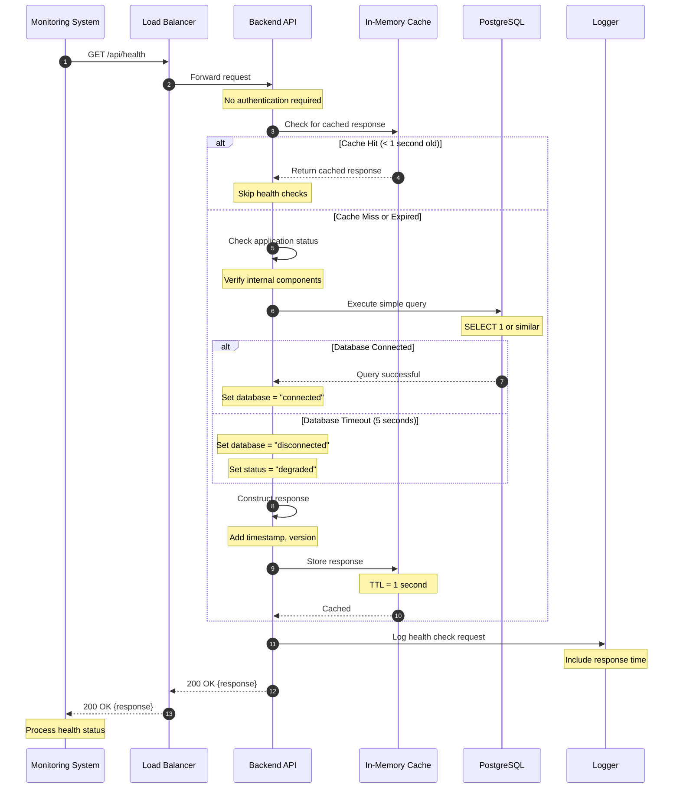
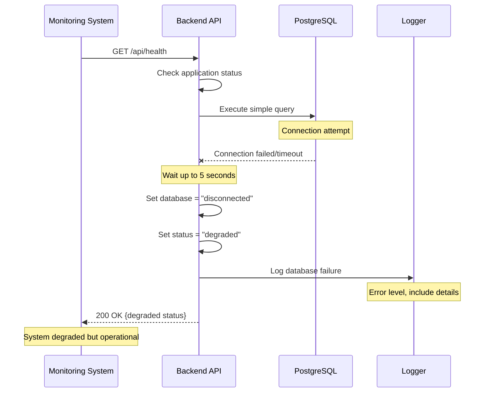
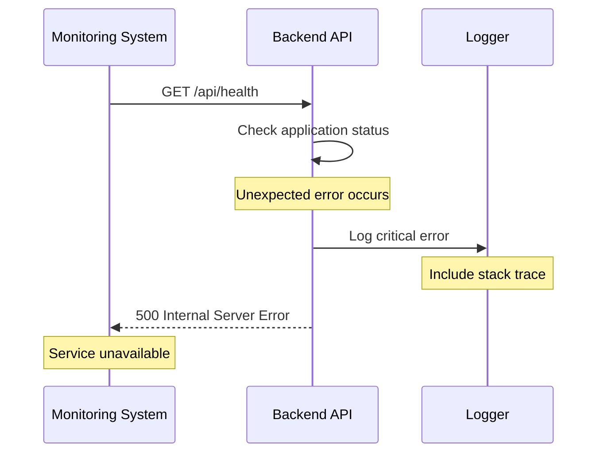
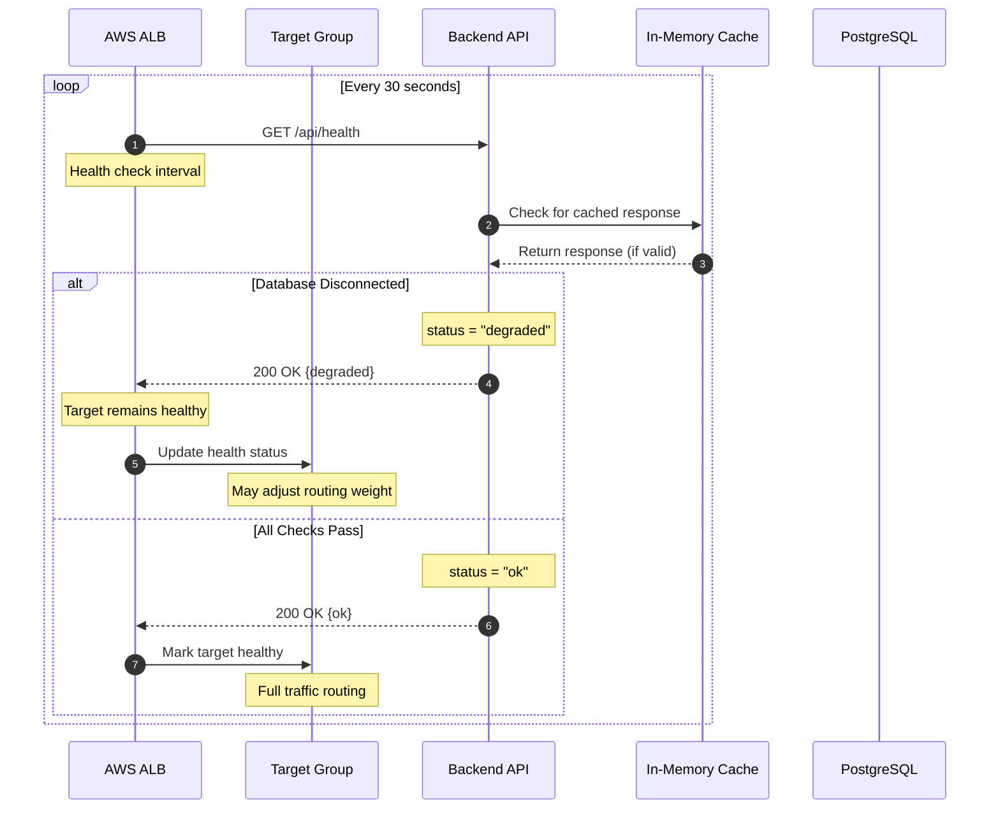
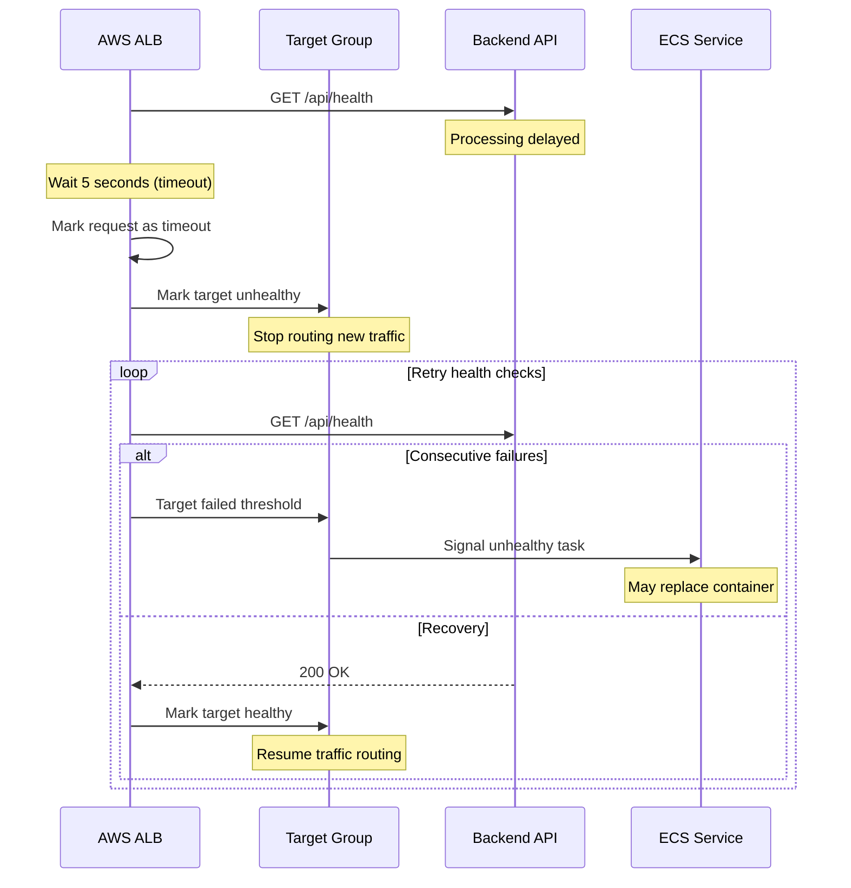
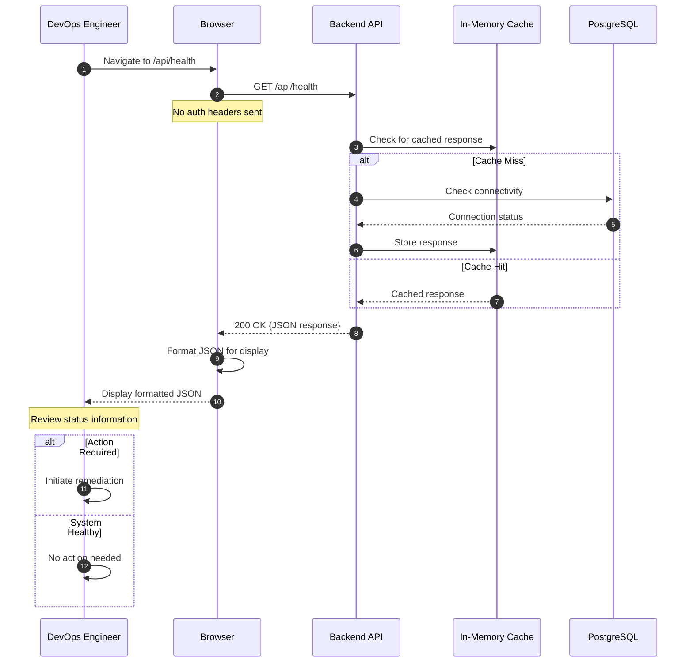
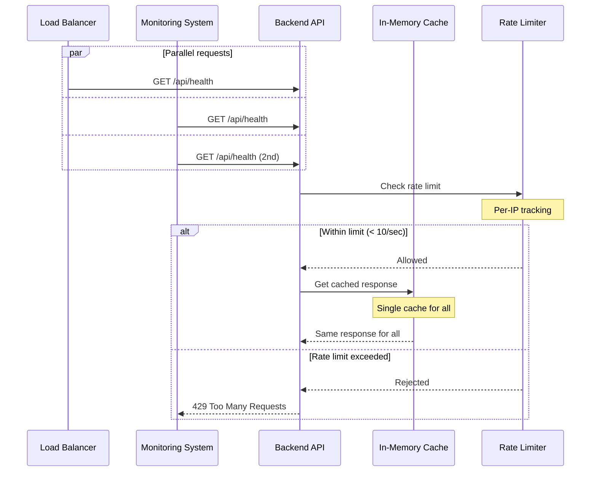
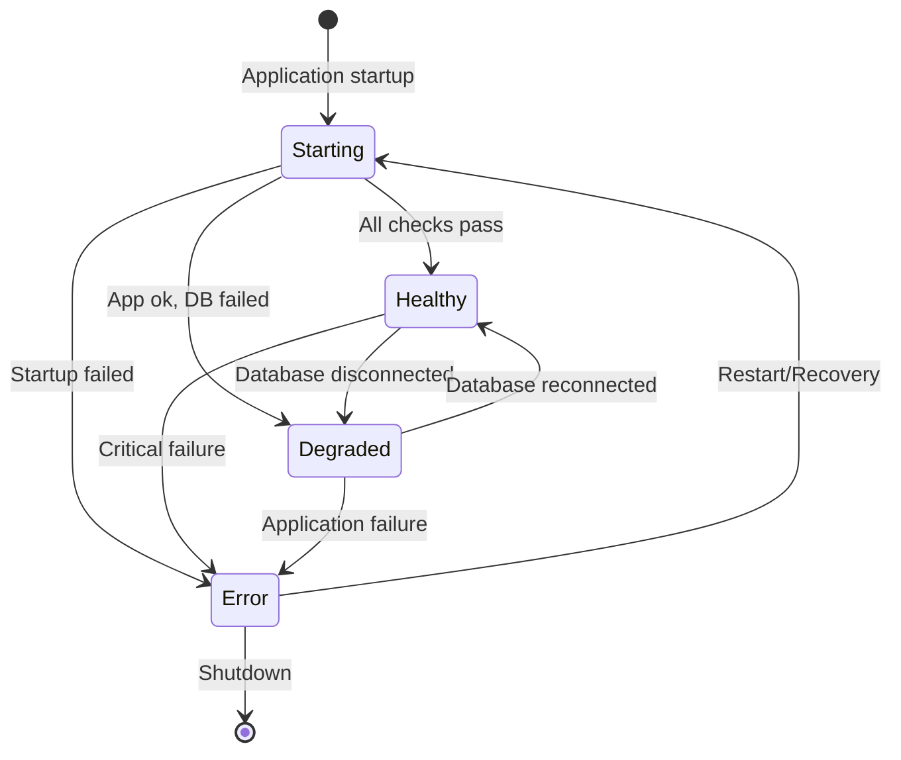
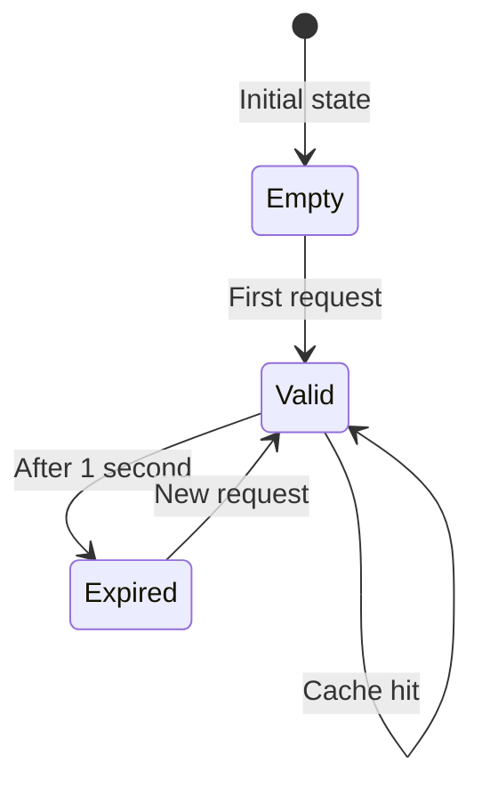

# Sequence Diagrams: Health Check

## Overview

Detailed interaction flows for all use cases defined in usecase.md, showing the complete request-response cycle for health check operations including caching, database connectivity verification, and error handling scenarios.

## Diagram Legend
- Solid arrow (->): Synchronous call
- Dashed arrow (-->): Asynchronous response
- Note: Internal processing
- Alt/Else: Conditional flow
- Loop: Repeated operations
- Par: Parallel processing

## Primary Sequences

### Sequence 1: UC-1 Basic Health Status Check

#### Success Flow


#### Error Flow - Database Connection Failed


#### Error Flow - Internal Server Error


### Sequence 2: UC-2 Load Balancer Health Verification

#### Success Flow with Degraded Status


#### Error Flow - Health Check Timeout


### Sequence 3: UC-3 Manual Status Verification

#### Success Flow with Browser


## Data Flow Details

### Request/Response Payloads

#### Request to /api/health
```
GET /api/health HTTP/1.1
Host: api.markmail.com
Accept: application/json
```
No request body or parameters required.

#### Success Response - All Healthy
```json
{
  "status": "ok",
  "timestamp": "2025-01-15T13:45:30.123Z",
  "database": "connected",
  "version": "1.2.3",
  "cached": false
}
```

#### Success Response - Degraded
```json
{
  "status": "degraded",
  "timestamp": "2025-01-15T13:45:30.123Z",
  "database": "disconnected",
  "version": "1.2.3",
  "cached": false
}
```

#### Success Response - From Cache
```json
{
  "status": "ok",
  "timestamp": "2025-01-15T13:45:29.500Z",
  "database": "connected",
  "version": "1.2.3",
  "cached": true
}
```

#### Error Response - Internal Error
```json
{
  "status": "error",
  "timestamp": "2025-01-15T13:45:30.123Z",
  "database": "unknown",
  "version": "1.2.3",
  "cached": false,
  "error": "Internal server error"
}
```

## Timing Constraints

### Performance Requirements
- API response time: < 100ms (p95)
- Database query: < 50ms (typical SELECT 1)
- Cache lookup: < 1ms
- Total end-to-end: < 100ms

### Timeout Settings
- Database connection timeout: 5 seconds
- Load balancer health check timeout: 5 seconds
- Cache TTL: 1 second (exactly)
- Rate limit window: 1 second (10 requests max)

## Concurrency Handling

### Concurrent Health Checks


## State Transitions

### Health Status State Machine


### Cache State Transitions


## Integration Points

### External Services
- **PostgreSQL Database**: Connection pool for health checks
- **In-Memory Cache**: Local cache, not Redis (for simplicity)
- **Load Balancer**: AWS ALB with configured health checks
- **Monitoring Systems**: CloudWatch, Datadog, etc.
- **Container Orchestration**: ECS, Kubernetes health probes

### Message Queue Events
None - Health check is read-only and doesn't publish events

### Dependencies
- Database connection pool must be initialized
- Application must be fully started
- Port 3000 must be bound and listening