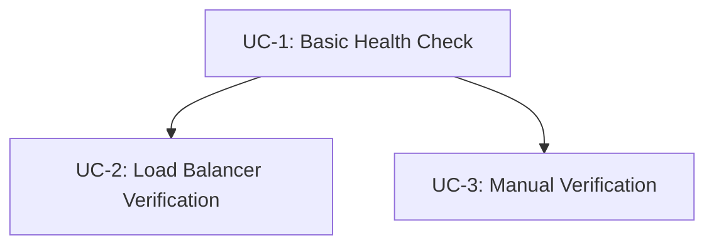

# Use Case Document: Health Check

## Overview

The health check feature provides a lightweight, unauthenticated endpoint for monitoring the application's operational status and database connectivity. This enables automated monitoring tools, load balancers, and container orchestration platforms to verify service availability and make routing decisions.

## Primary Actors

- **Monitoring System**: Automated tools that periodically check application health (CloudWatch, Datadog, etc.)
- **Load Balancer**: AWS ALB or similar that uses health checks for routing decisions
- **Container Orchestrator**: ECS, Kubernetes, or Docker Compose for container lifecycle management
- **DevOps Engineer**: Human operator checking system status manually
- **API Client**: External systems verifying service availability before making requests

## Use Cases

### UC-1: Basic Health Status Check

#### Actors
- Primary: Monitoring System
- Secondary: Load Balancer

#### Preconditions
- Application is deployed and running
- Network connectivity to the application exists
- Port 3000 is accessible

#### Basic Flow (Happy Path)
1. Monitoring System sends GET request to /api/health
2. System receives the HTTP request
3. System checks application status
4. System performs database connectivity check
5. System constructs JSON response with status information
6. System returns HTTP 200 with response body
7. Monitoring System receives and processes the response

#### Alternative Flows

##### AF-1.1: Cached Response Available
- At step 3, if a cached response exists (less than 1 second old)
- System returns the cached response immediately
- Skip steps 4-5, proceed to step 6

##### AF-1.2: Database Check Disabled
- At step 4, if database check is disabled in configuration
- System skips database connectivity check
- Sets database status to "not_checked"
- Continue with step 5

#### Exception Flows

##### EF-1.1: Database Connection Failed
- At step 4, if database connection fails or times out
- System sets database status to "disconnected"
- Sets overall status to "degraded"
- Logs error with details
- Continue with step 5

##### EF-1.2: Internal Server Error
- At any step, if an unexpected error occurs
- System logs the error with stack trace
- Returns HTTP 500 with error status
- Flow terminates

#### Postconditions
- Success: Health status is returned with all checks completed
- Failure: Error status is returned with available information

#### Data Elements Required

- Input Data:
  - None (GET request with no parameters)
  
- Output Data:
  - status: string - Overall health status ("ok", "degraded", "error")
  - timestamp: string - ISO 8601 formatted UTC timestamp
  - database: string - Database connectivity status ("connected", "disconnected", "not_checked")
  - version: string - Application version from build metadata
  - cached: boolean - Whether response is from cache
  
- Stored Data:
  - cached_response: JSON - Cached health check result
  - cache_timestamp: timestamp - When cache was last updated

#### Business Rules
- BR-1: Health checks must not require authentication
- BR-2: Response time must not exceed 100ms under normal conditions
- BR-3: Database check timeout is 5 seconds
- BR-4: Cache TTL is exactly 1 second
- BR-5: Rate limit is 10 requests per second per IP address

#### Non-Functional Requirements
- Performance: Response within 100ms (p95)
- Availability: Must be independent of other application features
- Security: No sensitive information in response

### UC-2: Load Balancer Health Verification

#### Actors
- Primary: Load Balancer (AWS ALB)
- Secondary: None

#### Preconditions
- Application is registered as target in load balancer
- Health check is configured in load balancer settings
- Target group health check interval is configured (typically 30 seconds)

#### Basic Flow (Happy Path)
1. Load Balancer sends GET request to /api/health
2. System processes health check (as in UC-1)
3. System returns HTTP 200 with status "ok"
4. Load Balancer marks target as healthy
5. Load Balancer routes traffic to this instance

#### Alternative Flows

##### AF-2.1: Degraded Status
- At step 3, if status is "degraded" (database disconnected)
- System still returns HTTP 200
- Load Balancer keeps target as healthy but may adjust weight
- Continue with step 4

#### Exception Flows

##### EF-2.1: Health Check Timeout
- At step 2, if response takes longer than ALB timeout (typically 5 seconds)
- Load Balancer marks target as unhealthy
- Load Balancer stops routing new traffic to instance
- After consecutive failures, instance may be replaced

##### EF-2.2: HTTP 5xx Response
- At step 3, if system returns HTTP 500/503
- Load Balancer marks target as unhealthy
- Traffic is routed to other healthy instances

#### Postconditions
- Success: Target remains healthy in load balancer
- Failure: Target marked unhealthy, traffic rerouted

#### Data Elements Required
- Same as UC-1

#### Business Rules
- BR-6: Must respond within load balancer timeout (5 seconds)
- BR-7: HTTP 200 for both "ok" and "degraded" status
- BR-8: HTTP 503 only when application cannot respond

#### Non-Functional Requirements
- Reliability: Must handle concurrent health checks
- Consistency: Status must accurately reflect system state

### UC-3: Manual Status Verification

#### Actors
- Primary: DevOps Engineer
- Secondary: None

#### Preconditions
- Engineer has network access to application
- Engineer has appropriate tools (curl, browser, etc.)

#### Basic Flow (Happy Path)
1. Engineer sends GET request to /api/health (via curl or browser)
2. System processes health check (as in UC-1)
3. System returns formatted JSON response
4. Engineer reviews status information
5. Engineer determines if action is needed

#### Alternative Flows

##### AF-3.1: Using Browser
- At step 1, if using web browser
- Browser displays JSON response
- Engineer uses browser JSON viewer for formatting

#### Exception Flows
- Same as UC-1

#### Postconditions
- Success: Engineer has current system status
- Failure: Engineer aware of system issues

#### Data Elements Required
- Same as UC-1

#### Business Rules
- Same as UC-1

#### Non-Functional Requirements
- Usability: JSON response must be human-readable
- Accessibility: Available without authentication

## Data Element Summary

### Core Entities Identified

Based on all use cases, the following data entities are required:

1. **HealthCheckResponse**
   - Purpose: Standardized response structure for health status
   - Key Attributes:
     - status: string - Enumeration of "ok", "degraded", "error"
     - timestamp: DateTime - UTC timestamp of check
     - database: string - Database connection status
     - version: string - Application version
     - cached: boolean - Cache indicator
   - Relationships:
     - None (standalone response object)

2. **HealthCheckCache**
   - Purpose: Temporary storage of health check results
   - Key Attributes:
     - response: JSON - Cached response body
     - created_at: DateTime - Cache creation time
     - ttl: integer - Time to live in seconds (always 1)
   - Relationships:
     - None (in-memory cache)

3. **HealthCheckMetrics**
   - Purpose: Track health check performance and failures
   - Key Attributes:
     - request_count: integer - Total requests
     - failure_count: integer - Failed checks
     - average_response_time: float - Response time in ms
     - last_check: DateTime - Most recent check time
   - Relationships:
     - None (metrics storage)

### Calculated Fields
- cached = (current_time - cache_timestamp) < 1 second
- status = if (all_checks_pass) "ok" else if (app_running) "degraded" else "error"
- response_time = end_time - start_time

## Use Case Dependencies

## Acceptance Criteria Summary

Key acceptance criteria from requirements that will guide implementation:
- Endpoint responds without authentication
- Response includes status, timestamp, database, and version fields
- Database check uses existing connection pool
- Response time under 100ms with 1-second cache TTL
- Appropriate HTTP status codes (200 for ok/degraded, 503 for unavailable)
- Rate limiting at 10 requests per second per IP
- Comprehensive error handling and logging